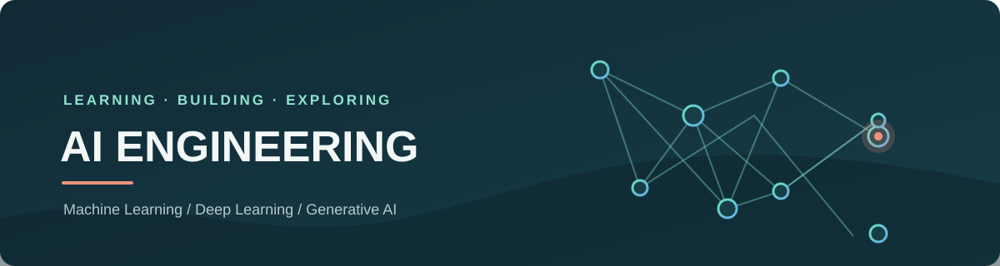

	

<h1 align="center">Hi, I'm Thanh Binh</h1>

<strong>AI Engineering Student | Machine Learning · Deep Learning · Generative AI</strong>

## About Me

I'm a student pursuing a career as an AI Engineer, focused on building a strong foundation in artificial intelligence and turning what I learn into practical projects. I'm especially interested in machine learning, deep learning, and generative AI, and in how these technologies can solve real-world problems.

## Current Focus

- Studying core concepts in machine learning and deep learning
- Exploring generative AI and large language model applications
- Building hands-on projects to strengthen my software engineering and problem-solving skills

## Areas of Interest

- Applied machine learning and intelligent systems
- Natural language processing and generative AI
- Responsible, useful AI products

## Collaboration

I'm interested in connecting with developers and AI practitioners, learning from the community, and collaborating on practical AI projects.
